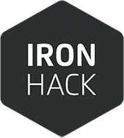

# Gi**f**tHub

## Ironhack Project #2
From March to June 2018 I attended a **Full Stack Web Development Bootcamp** in Paris with [Ironhack](http://www.ironhack.com/en).

The program was very dense yet well structured and I learnt the following tech stack & tools:
- Angular 5
- Node.js
- MongoDB
- Mongoose
- Express.js
- Javascript & Typescript
- HTML 5 / CSS 3
- GitHub
- Bash CLI

GiftHub is the second of three projects I did during the bootcamp. It was created with my fellow Ironhacker @mbbaber, hope you enjoy it!

### [>>Here's the app!](https://ironhack-gifthub.herokuapp.com/groups/5ae3212634baaf0014d86c20/5ae320e334baaf0014d86c1e)

## Context

The insctructions were to create a

## What is the app about?

## How does the tech work under the hood?

## Summary
This was 

Hope you enjoyed using it, and don't hesitate to give me any (constructive) feedback!
